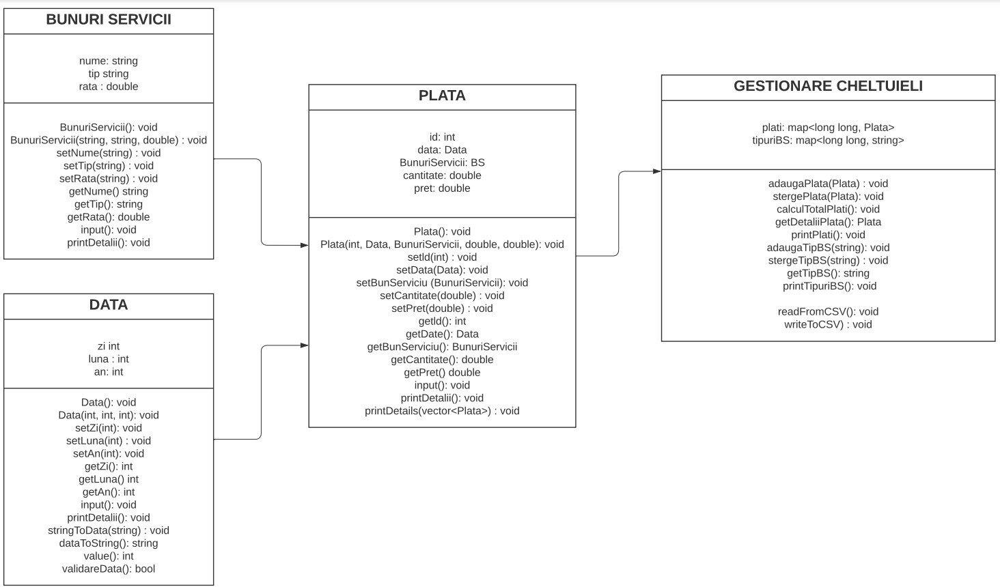

# Proiect-POO
Gestionare cheltuieli

Aplicația permite utilizatorului să adauge o plată nouă care va cuprinde informații referitoare la data, numele și tipul bunului sau serviciului, cantitatea și prețul acesteia. S-a dorit ca utilizatorul să aibă posibilitatea de a căuta, după anumite criterii o plată, să o șteargă și să afișeze toate plățile efectuate. În plus, acesta poate calcula suma totală cheltuită într-un interval de timp. Aplicația vine cu o listă predefintă de bunuri și servicii pentru care utlizatorul are la dispoziție opțiunile de adăugare și ștergere. Toate plățile sunt salvate într-un fișier.

Diagrama UML a claselor:

  

