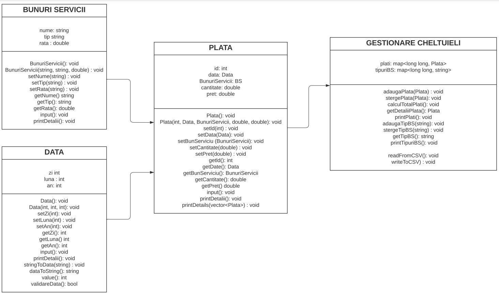
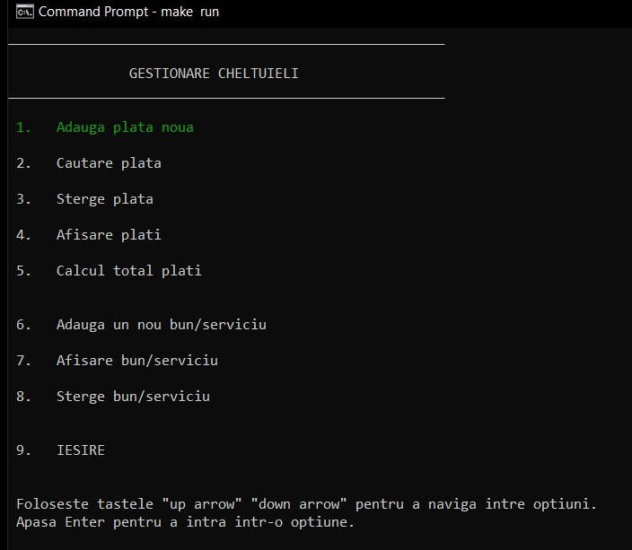
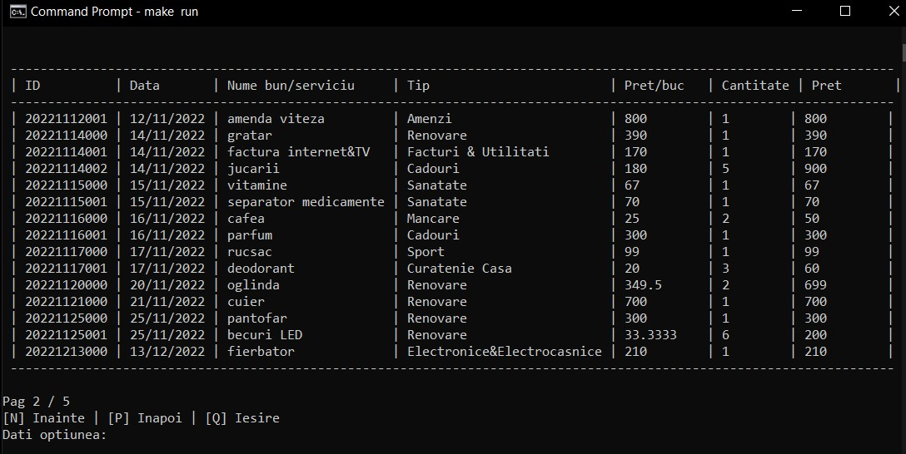
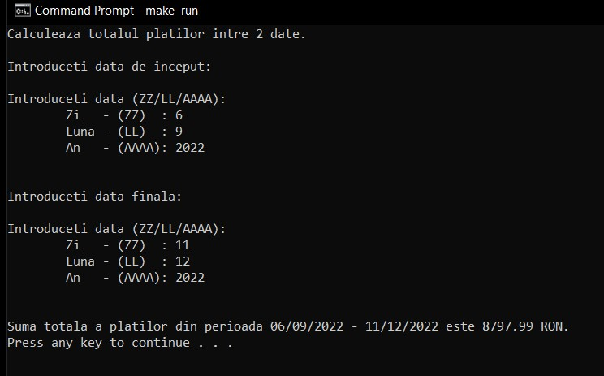
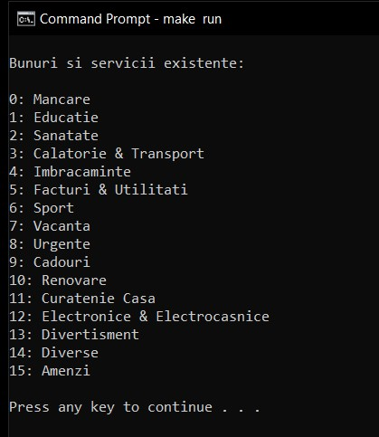

# Proiect-POO
Gestionare cheltuieli  

Aplicația permite utilizatorului să adauge o plată nouă care va cuprinde informații referitoare la data, numele și tipul bunului sau serviciului, cantitatea și prețul acesteia. S-a dorit ca utilizatorul să aibă posibilitatea de a căuta, după anumite criterii o plată, să o șteargă și să afișeze toate plățile efectuate. În plus, acesta poate calcula suma totală cheltuită într-un interval de timp. Aplicația vine cu o listă predefintă de bunuri și servicii pentru care utlizatorul are la dispoziție opțiunile de adăugare și ștergere. Toate plățile sunt salvate într-un fișier.  


Utilizarea fisierelor makefile:
- Pentru Windows, una dintre metode este folosirea Chocolatey.  Odată instalat de pe [link](https://chocolatey.org/install), trebuie să instalați make (prin intermediul Windows Powershell) `choco install make`;
- Pentru Linux, se va folosi comanda ` sudo apt-get install make `;
- In folderul in care se afla proiectul se vor da comenzile:
   - pentru build: 
  ```bash
     make all        # universal;
  ```
   - pentru run & execute:
  ```bash
     make run        # universal;
  ```
   - pentru a sterge fisierele:
  ```bash
     make clean      #  linux/macOS;
     make clean(win) #  windows;
  ```
<br>
Alternativ, proiectul se poate deschide utilizand CodeBlocks.
<br>
<br>
Diagrama UML a claselor:
<br>
<p align="center">
  
</p>

<br>

## Interfata
<p align="center">
  
</p>

## Afisare
<p align="center">
  
</p>

## Calcul plati
<p align="center">
  
</p>

## Bunuri si servicii existente
<p align="center">
  
</p>

